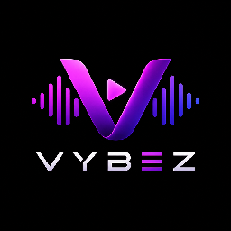

<div align="center">



# VYBEZ

### Hallgass zenét máshogy. 🎧

*Your music. Your vibe.*

[](#)
[](#)
[](#)
[](#)
[](#)

[🌐 Weboldal](http://vybezapp.fejlessz.hu) · [✨ Funkciók](#-funkciók) · [📦 Telepítés](#-telepítés)

</div>

---

## 💜 Mi ez pontosan?

**VYBEZ** egy natív Windows desktop app, ami a zenelejátszó weboldalt csomagolja be egy Electron wrapperbe — tálcaikonnal, Discord Rich Presence-szel és egy saját, kód-védett telepítővel. Reklám nélküli zenehallgatás, modern UI, teljes asztali integráció. 🔥

## ✨ Funkciók

| | |
|---|---|
| 🎵 | **320+ zenetalálat** — gyors, modern kereső |
| ⬇️ | **Zeneletöltés** közvetlenül mp3 formátumban |
| 💜 | **Kedvencek** — mentsd el, amit újra és újra hallgatnál |
| 📂 | **Playlistek** — saját playlist, saját vibe |
| 🎨 | **Téma váltás** — alakítsd a kinézetet saját stílusra |
| 🌌 | **Élő háttér** — animált, modern vizuál |
| 🎮 | **Discord Rich Presence** — mutasd mit hallgatsz |
| 🚫 | **0 reklám** — semmi megszakítás, csak a zene |

<p align="center">
  
</p>

## 🖥️ Amit az Electron wrapper hoz a buliba

A weboldal adja a UI-t és a zenei logikát, az app ezt egészíti ki natív desktop integrációkkal:

- **🎮 Discord Rich Presence** — saját parsing motor tisztítja a nyers YouTube címeket (`(Official Video)`, `[Lyrics]`, `feat. ...`, remix/edit/live taggek stb.), másodperc-pontos progress barral és a track thumbnailjével mint nagy borítóképpel.
- **🗂️ Tálcaikon (Tray)** — ablak elrejtése/megnyitása, kilépés, minden magyarul.
- **📦 Squirrel-startup kezelés** — natív Windows installer/frissítő logika.
- **🔐 Egyedi, kód-védett telepítő** — a NSIS installer egy 5 jegyű kódot kér telepítés előtt, amit élőben ellenőriz a szerverrel.

<p align="center">
  
</p>

## 🛠️ Tech stack

- **Electron** `35.1.4`
- **discord-rpc** — natív Discord integráció
- **electron-builder** build pipeline (NSIS)
- **NSIS + nsDialogs** — egyedi, custom telepítő lépés

## 📁 Projekt felépítés

```
VYBEZAPP/
├── src/
│   ├── index.js        # Main process – ablak, tray, Discord RPC, track parsing
│   ├── preload.js      # contextBridge – biztonságos IPC híd a weboldal felé
├── installer.nsh        # Egyedi NSIS telepítő lépés (kódellenőrzés)
└── package.json
```

## ⚙️ Hogyan működik?

1. A főablak betölti a zenelejátszó weboldalt — ez maga a player UI.
2. A `preload.js` egy `window.electronAPI.sendMusicUpdate(track)` függvényt tesz elérhetővé a weboldal JS-ének, biztonságos `contextBridge` mögött.
3. Amikor a weboldal zeneváltást küld, a main process letisztítja a számcímet, és frissíti a Discord Activityt — élő progress barral és borítóképpel.
4. Lejátszás nélkül egy stílusos "idle" presence fut: *"with vibes $"* / *"made by 𝖔𝖑𝖎𝖛€𝖊𝖗"*.

## 📦 Telepítés

1. Töltsd le a legfrissebb installert: [vybezapp.fejlessz.hu](http://vybezapp.fejlessz.hu/letöltés)
2. Futás közben írd be az **5 jegyű telepítőkódot** — a telepítő ezt élőben ellenőrzi a szerverrel.
3. Kész — irány a VYBEZ! 🎧

> ⚠️ Jelenleg csak **Windows** alatt elérhető.


## 📜 Licenc

`UNLICENSED` — privát projekt, minden jog fenntartva.

---

<div align="center">

*with love for love <3*

**𝖔𝖑𝖎𝖛€𝖊𝖗**

</div>
